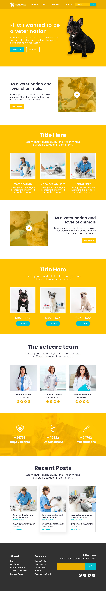
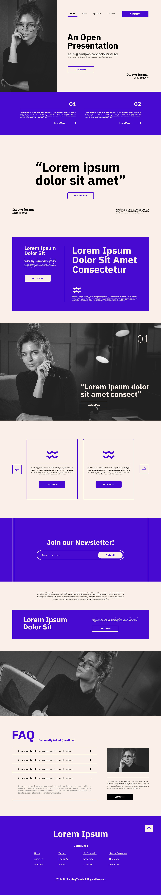
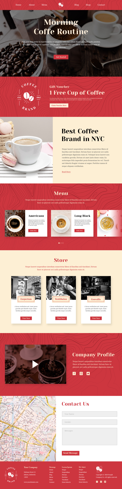

# Tecnico progettazione e sviluppo Web - Sviluppo ed implementazione

 

* [Lezioni](#lessons)
* [Mockups](#mockups)
* [Codepens](#codepens)
* [Risorse/Link](#resources)

 

## Lezioni

* [24/10/2024](./lezioni/2024-10-24.pdf)
* [25/10/2024](./lezioni/2024-10-25.pdf)

## Mockups

<table width="100%">
    <tr>
        <td><strong>Sito #1</strong></td>
        <td><strong>Sito #2</strong></td>
        <td><strong>Sito #3</strong></td>
        <td><strong>Sito #4</strong></td>
        <td><strong>Sito #5</strong></td>
        <td><strong>Sito #6</strong></td>
    </tr>
    <tr>
        <td valign="top">
            
        </td>
        <td valign="top">
            
        </td>
        <td valign="top">
            
        </td>
        <td valign="top">
            
        </td>
        <td valign="top">
            
        </td>
        <td valign="top">
            
        </td>
    </tr>
</table>

## Codepens

* [HTML](https://codepen.io/danielrampanelli/pen/vYoWObY)
* [HTML / Elementi: Titoli](https://codepen.io/danielrampanelli/pen/abeVvKb)
* [HTML / Elementi: Testi](https://codepen.io/danielrampanelli/pen/RwXjaoO)
* [HTML / Elementi: Liste](https://codepen.io/danielrampanelli/pen/PoMONmY)
* [HTML / Elementi: Immagine](https://codepen.io/danielrampanelli/pen/VworaQN)
* [HTML / Elementi: Audio](https://codepen.io/danielrampanelli/pen/xxvPjRO)
* [HTML / Elementi: Video](https://codepen.io/danielrampanelli/pen/rNXYevJ)
* [HTML / Elementi: Struttura](https://codepen.io/danielrampanelli/pen/eYqeZKV)
* [HTML / Attributi](https://codepen.io/danielrampanelli/pen/YzmEqjo)
* [CSS / Selettori](https://codepen.io/danielrampanelli/pen/eYqeZLV)
* [CSS: Valori](https://codepen.io/danielrampanelli/pen/JjgOXew)
* [CSS: Box Model](https://codepen.io/danielrampanelli/pen/ZEgaWVr)
* [CSS: Sfondi](https://codepen.io/danielrampanelli/pen/rNXYeov)
* [CSS: Testi](https://codepen.io/danielrampanelli/pen/zYgPqyL)
* [CSS: Font](https://codepen.io/danielrampanelli/pen/JjgOBXV)
* [CSS: Dimensioni](https://codepen.io/danielrampanelli/pen/ExqbKGe)
* [CSS: Bordi](https://codepen.io/danielrampanelli/pen/abeVNPR)
* [CSS: Flusso di pagina](https://codepen.io/danielrampanelli/pen/mdNqKqY)
* [CSS: Elementi float](https://codepen.io/danielrampanelli/pen/QWeOxaE)
* [CSS: Posizonamento](https://codepen.io/danielrampanelli/pen/xxvPVmQ)
* [CSS: Flexbox #1](https://codepen.io/danielrampanelli/pen/KKOyBvo)
* [CSS: Flexbox #2](https://codepen.io/danielrampanelli/pen/KKOyBvo)

## Risorse/Link

* [Generatore di testo finto](https://loremipsum.io)
* [Lista di colori CSS predefiniti](https://www.w3schools.com/tags/ref_colornames.asp)
* [Generatore di gradienti CSS](https://cssgradient.io)
* [Lista di font web gratuiti](https://fonts.google.com)
* [Flexbox Poster](https://css-tricks.com/wp-content/uploads/2022/02/css-flexbox-poster.png)
* [Immagini reali per placeholder/segnaposto](https://picsum.photos)
* [Foto 640x400 random](https://picsum.photos/640/400)
* [Foto 1280x800 random](https://picsum.photos/1280/800)
* [Foto 640x400 random (bianco/nero)](https://picsum.photos/640/400?grayscale)
* [Foto 1280x8000 random (bianco/nero)](https://picsum.photos/1280/800?grayscale)
* [Audio MP3 di esempio #1](https://download.samplelib.com/mp3/sample-3s.mp3)
* [Video MP4 di esempio #1](https://onlinetestcase.com/wp-content/uploads/2023/06/1MB.mp4)
* [Video MP4 di esempio #2](https://file-examples.com/storage/feb05093336710053a32bc1/2017/04/file_example_MP4_480_1_5MG.mp4)