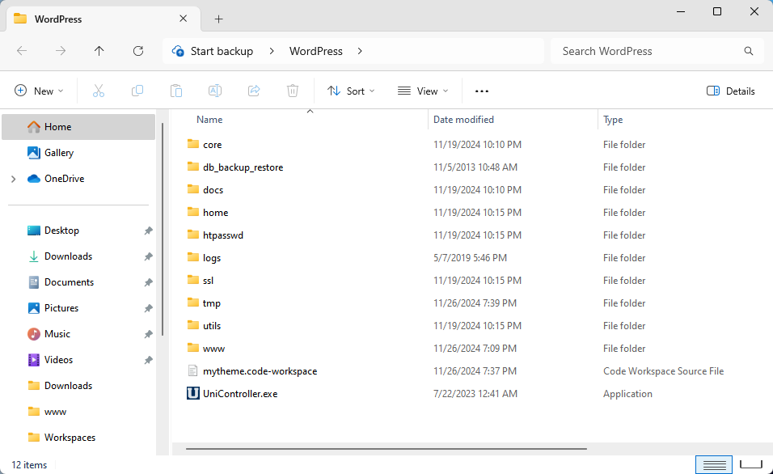
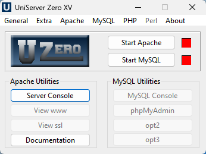
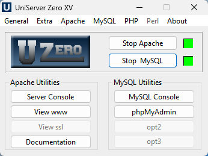
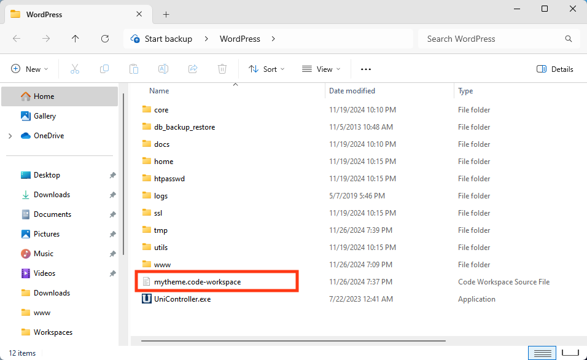
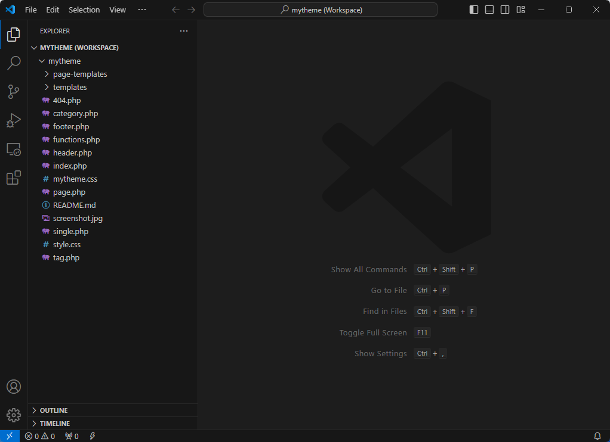

# WordPress

La seguente guida permetterà di lavorare "in locale" (sul vostro computer) con un sito in WordPress.

## Installazione

Per far funzionare un sito in WordPress serve un "web server" (Apache, PHP) e un "database server" (MySQL).

Qui di seguito potete scaricare un pacchetto software per Windows che contiene tutto il necessario e non necessita particolari operazioni di installazione:

[WordPress-Windows.zip](https://drive.google.com/uc?export=download&id=138unkJPh5ZkW-LD-EIbavGjb5YMJeCa6)

Una volta scaricato, estraete i file dell'archivio e spostate la cartella `WordPress` dove preferite.



Nella cartella `WordPress` eseguite l'applicazione `UniController` e se vi vengono chiesti permessi o autorizzazioni, confermate e date il consenso.



Per avviare tutti i servizi necessari, cliccare su `Start Apache` e `Start MySQL`.



Dq questo momento potete visitare la [pagina principale del sito](http://localhost/) oppure [l'interfaccia gestionale del sito](http://localhost/wp-admin/).

## Gestionale WordPress

Per accedere al gestionale del sito visitate il seguente link:

[http://localhost/wp-admin/](http://localhost/wp-admin/)

Le credenziali per accedere al sistema sono

    Utente:   admin
    Password: admin

## Tema WordPress

In questa installazione di WordPress fornita è già presente e attivo un tema personalizzato. Per aprire la cartella del tema con l'editor di testo (Visual Studio Code) fate doppio-click sul file `mytheme.code-workspace` (oppure solo `mytheme`).





Una volta aperto l'editor di testo, potete modificare a piacimento i file.

Segue una breve descrizione di ogni file presente nella cartella:

| Nome                               | Descrizione |
|------------------------------------|-------------|
| **404.php**                        | File che viene utilizzato quando l'indirizzo non può essere trovato e/o la pagina non esiste. |
| **category.php**                   | Template che viene utilizzato quando si visualizza una singola `categoria`. |
| **footer.php**                     | File template che viene incluso in fondo a tutti i template (tramite `get_footer()`). |
| **functions.php**                  | Impostazioni generale del tema. **Non utilizzare per lavorare sui template.** |
| **header.php**                     | File template che viene incluso in testata a tutti i template (tramite `get_header()`). |
| **home.php**                       | Template che viene utilizzato quando si visualizza la pagina iniziale del sito (se non è stata impostata una pagina di partenza diversa). |
| **index.php**                      | File segnaposto necessario per WordPress. **Non utilizzare per lavorare sui template.** |
| **mytheme.css**                    | Stili per le pagine del tema. |
| **page.php**                       | Template che viene utilizzato quando si visualizza una singola `pagina`. |
| **page-templates/lista-post.php**  | Template di pagina di esempio che mostra i contenuti della pagina in maniera personalizzata. |
| **page-templates/stile-dark.php**  | Template di pagina di esempio che mostra i contenuti della pagina in maniera personalizzata. |
| **page-templates/stile-light.php** | Template di pagina di esempio che mostra i contenuti della pagina e mostra un esempio di `query` e `loop` (ciclo) di articoli. |
| **screenshot.jpg**                 | Immagine del tema, visualizzata nel gestionale del sito. **Non utilizzare per lavorare sui template.** |
| **single.php**                     | Template che viene utilizzato quando si visualizza un singolo `articolo`. |
| **style.css**                      | Informazioni generale del tema. **Non utilizzare per lavorare sui template.** |
| **tag.php**                        | Template che viene utilizzato quando si visualizza un singolo `tag`. |
| **templates/loop-item.php**        | File template utilizzato nel template di pagina `template-lista-post.php`. |
| **templates/loop-notfound.php**    | File template utilizzato nel template di pagina `template-lista-post.php`. |

In base a quello che dovete fare, dovete individuare il file giusto e applicare le relative modifiche. Qui di seguito qualche esempio:

* Aggiungere menu o elementi in testata alle pagine: `header.php`
* Aggiungere testi/contenuti o menu in fondo alle pagine: `footer.php`
* Aggiornare il CSS del tema: `mytheme.css`
* Modificare la veste grafica/codice delle pagine (template predefinito): `page.php`
* Modificare la veste grafica/codice di un template di pagina: il relativo file nella cartella `page-templates`
* Cambiare la struttura/layout degli articoli: `single.php`
* Aggiungere/modificare del testo nella pagina mostrata quando l'indirizzo non può essere trovato: `404.php`

## Funzioni

### get\_header

Include l'header del tema.

```php
<?php get_header(); ?>
```

### get\_footer

Include il footer del tema.

```php
<?php get_footer(); ?>
```

### wp\_nav\_menu

Include il menu nella posizione indicata.

```php
<?php wp_nav_menu([
    'theme_location' => 'principale',
]); ?>
```

Le possibili posizioni configurate nel tema sono:
* principale
* secondario
* social
* footer

### the\_title

Titolo del post/della pagina.

```php
<h1><?php the_title(); ?></h1>
```

### the\_excerpt

Riassunto del post/della pagina.

```php
<div class="excerpt"><?php the_excerpt(); ?></div>
```

### the\_modified\_date

Data di pubblicazione del post utilizzando il formato definito nelle impostazioni.

```php
<div class="date"><?php the_modified_date(); ?></div>
```

### the\_time

Ora di pubblicazione del post utilizzando il formato definito nelle impostazioni.

```php
<div class="time"><?php the_time(); ?></div>
```

### the\_content

Contenuto del post/della pagina.

```php
<div class="content"><?php the_content(); ?></div>
```

### the\_permalink

Link al post/alla pagina, restituisce solo l'URL completo.

```php
<a href="<?php the_permalink(); ?>">Vai al post</a>
```

### the\_post\_thumbnail

Immagine del post/della pagina come codice HTML, tag `` con tutti gli attributi.

```php
<?php the_post_thumbnail(); ?>
```

### the\_posts

Funzione personalizzata per selezionare e mostrare post dinamicamente utilizzando dei file "loop template".

```php
<?php the_posts([
    'posts_per_page' => 6,
    'template' => 'templates/loop-item.php',
    'not_found' => 'templates/loop-notfound.php',
]); ?>
```

I parametri possibili sono:

| Nome               | Valore Default | Descrizione |
|--------------------|----------------|-------------|
| **category**       | (nessuno) | Filtra articoli per categoria (indicare lo "slug" della categoria).<br>Esempio: `'category' => 'eventi',` |
| **tag**            | (nessuno) | Filtra articoli per tag (indicare lo "slug" del tag).<br>Esempio: `'tag' => 'musica',` |
| **year**           | (nessuno) | Filtra articoli per anno.<br>Esempio: `'year' => 2023,` |
| **posts_per_page** | (`-1`, nessun limite) | Limita il numero massimo di articoli selezionati. Se non indicato, non viene applicato nessun limite.<br>Esempio: `'posts_per_page' => 10,` |
| **orderby**        | `'date'` | Ordina gli articoli utilizzando differenti criteri, valori possibili: `date`, `title`, `random`.<br>Esempio: `'year' => 2023,` |
| **order**          | `'desc'` | Definisce la "direzione" (ordine alfabetico) degli articoli selezionati, valori possibili: `asc` (a-z, 0-9), `desc` (z-a, 9-0).<br>Esempio: `'order' => 'asc',` |
| **template**       | (nessuno) | Utilizza il template file indicato per ogni articolo trovato.<br>Esempio: `'template' => 'templates/nomefile.php',` |
| **not_found**      | (nessuno) | Include il template file indicato se non sono stati trovati risultati.<br>Esempio: `'not_found' => 'templates/nomefile.php',` |

## Query

L'esempio mostra i 3 post più recenti, ordinati dal più recente al più vecchio. Il file `templates/loop-item.php` viene ripetuto per tutti i post trovati, se non vengono trovati risultati viene incluso il file `templates/loop-notfound.php`.

```php
<?php the_posts([
    'posts_per_page' => 3,
    'orderby' => 'date',
    'order' => 'desc',
    'template' => 'templates/loop-item.php',
    'not_found' => 'templates/loop-notfound.php',
]); ?>
```

### Selezione ultimi N post

Rimpiazza `3` con il numero desiderato di post e `loop-item.php` con un file diverso (se necessario).

```php
<?php the_posts([
    'posts_per_page' => 3,
    'template' => 'templates/loop-item.php',
]); ?>
```

### Selezione tutti i post di una categoria

Rimpiazza `eventi` con lo slug della categoria e `loop-item.php` con un file diverso (se necessario).

```php
<?php the_posts([
    'category_name' => 'eventi',
    'template' => 'templates/loop-item.php',
]); ?>
```

### Selezione i post recenti di un tag

Rimpiazza `report` con lo slug del tag, `10` con il numero di post necessari e `loop-item.php` con un file diverso (se necessario).

```php
<?php the_posts([
    'tag' => 'report',
    'posts_per_page' => 10,
    'template' => 'templates/loop-item.php',
]); ?>
```

### Selezione i post recenti ordinati per titolo

Rimpiazza `5` con il numero di post necessari e `loop-item.php` con un file diverso (se necessario).

```php
<?php the_posts([
    'posts_per_page' => 5,
    'orderby' => 'title',
    'order' => 'asc',
    'template' => 'templates/loop-item.php',
]); ?>
```
